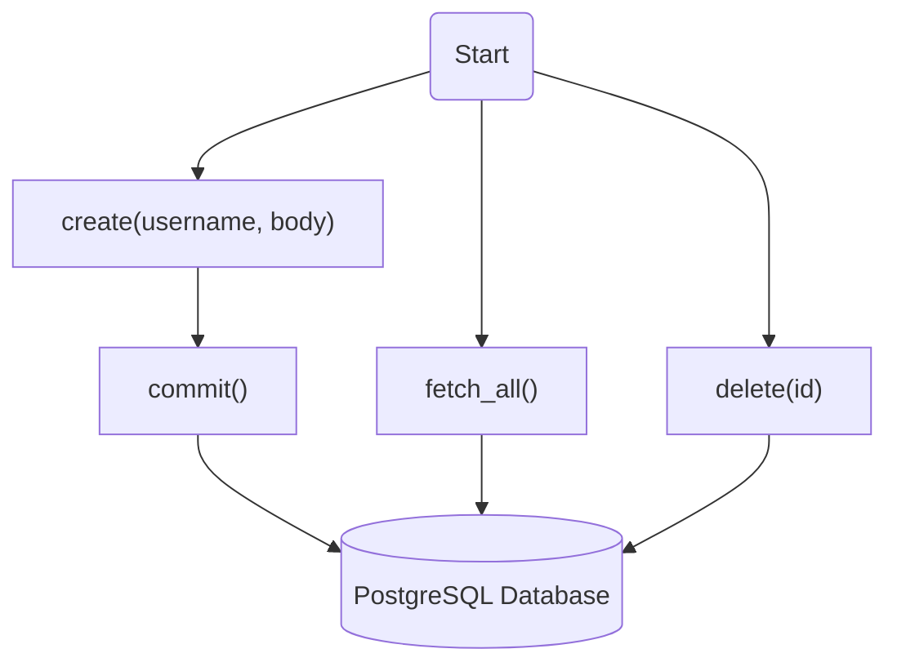
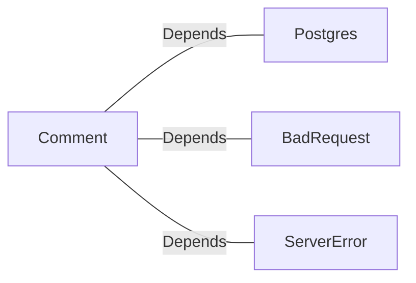

# Comment.java: Comment Management System

## Overview
The `Comment` class is responsible for managing user comments in a system. It provides functionalities to create, fetch, and delete comments, as well as persisting them in a database. The class interacts with a PostgreSQL database to store and retrieve comment data.

## Process Flow

## Insights
- The class uses a PostgreSQL database for storing and retrieving comments.
- The `create` method generates a unique ID for each comment using `UUID` and timestamps the creation time.
- The `fetch_all` method retrieves all comments from the database and maps them to `Comment` objects.
- The `delete` method removes a comment from the database based on its ID.
- The `commit` method is a private helper function used to insert a new comment into the database.
- Exception handling is implemented to manage database-related errors, but the `delete` method always returns `false` due to a misplaced `return` statement in the `finally` block.

## Dependencies

- `Postgres`: Provides the database connection for executing SQL queries.
- `BadRequest`: Used to throw an exception when a comment cannot be saved.
- `ServerError`: Used to throw an exception for server-related errors.

## Data Manipulation (SQL)
### Table Structure: `comments`
| Attribute   | Data Type   | Description                          |
|-------------|-------------|--------------------------------------|
| `id`        | `VARCHAR`   | Unique identifier for the comment.  |
| `username`  | `VARCHAR`   | Username of the comment's author.   |
| `body`      | `TEXT`      | Content of the comment.             |
| `created_on`| `TIMESTAMP` | Timestamp of when the comment was created. |

### SQL Operations
- **INSERT**: Adds a new comment to the `comments` table.
  - `commit()`: Executes the `INSERT INTO comments (id, username, body, created_on) VALUES (?,?,?,?)` query.
- **SELECT**: Retrieves all comments from the `comments` table.
  - `fetch_all()`: Executes the `SELECT * FROM comments;` query.
- **DELETE**: Removes a comment from the `comments` table based on its ID.
  - `delete(id)`: Executes the `DELETE FROM comments WHERE id = ?` query.
